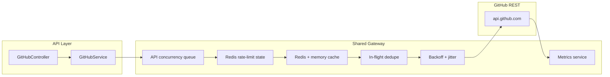

# GitHub API Optimization Report

## Before: why the rate limit was exhausted

All GitHub REST traffic flowed through [`apps/api/src/modules/github/github.service.ts`](apps/api/src/modules/github/github.service.ts) with:

- Direct `Octokit` usage per request (new client per OAuth token, no shared gateway)
- Up to **20 local file workers** and **3 repository workers** all calling GitHub directly
- **One `git.getBlob` per candidate file** with no shared throttling
- No `x-ratelimit-*` tracking, no pause-before-exhaustion, no retry coordination
- No request deduplication or cross-worker cache
- No skip-cache for unchanged blob SHAs on rescans

### Highest-volume endpoints (per repository scan)

| Endpoint | Calls per repo | Notes |
|----------|----------------|-------|
| `GET /git/blobs/{sha}` | 1 × metadata files | Dominant cost |
| `GET /git/trees/{sha}?recursive=1` | 1 | Full tree |
| `GET /git/commits/{sha}` | 1 | Branch head |
| `GET /git/ref/heads/{branch}` | 1 | Branch ref |
| `GET /user/repos` | 1+ pages | Repo list |

Scanning 100 repos × ~30 metadata files ≈ **3,000+ blob requests** plus tree/ref/commit overhead → core limit exhaustion.

## After: new request flow



## Changes implemented

| File | Change |
|------|--------|
| `apps/api/src/modules/github/gateway/github-gateway.service.ts` | Central gateway: auth reuse, throttling, retry, dedup, cache |
| `apps/api/src/modules/github/gateway/github-rate-limit.service.ts` | Redis-backed `x-ratelimit-*` tracking + safety pause |
| `apps/api/src/modules/github/gateway/github-cache.service.ts` | Memory + Redis cache |
| `apps/api/src/modules/github/gateway/github-metrics.service.ts` | Metrics counters |
| `apps/api/src/modules/github/gateway/github-retry.ts` | Backoff / jitter / header parsing |
| `apps/api/src/modules/github/gateway/scan-retry-queue.service.ts` | BullMQ scaffold for durable resume |
| `apps/api/src/modules/github/github.service.ts` | All GitHub calls routed through gateway; blob skip cache |
| `apps/api/src/config/environment.ts` | New concurrency + rate-limit env vars |
| `apps/api/src/modules/github/github.controller.ts` | `GET /github/metrics/rate-limit` |
| `apps/api/test/github-retry.test.ts` | Retry/backoff tests |
| `apps/api/test/github-metrics.test.ts` | Metrics tests |

## New environment variables

```env
LOCAL_SCAN_WORKERS=20
GITHUB_API_CONCURRENCY=2
GITHUB_API_MIN_TIME_MS=250
GITHUB_RATE_LIMIT_SAFETY_THRESHOLD=100
GITHUB_MAX_RETRIES=5
GITHUB_RETRY_BASE_DELAY_MS=1000
GITHUB_RETRY_MAX_DELAY_MS=60000
GITHUB_CACHE_TTL_SECONDS=300
REDIS_URL=redis://localhost:6379/0
```

## Expected API reduction

| Optimization | Expected savings |
|--------------|------------------|
| Blob SHA cache (clean/infected) | 50–90% on rescans |
| Request deduplication | 10–30% under parallel scans |
| API concurrency cap (2) + spacing | Prevents burst exhaustion |
| Safety pause at 100 remaining | Avoids hard 403 failures |
| Retry with reset/retry-after | Recovers failed files without full rescan |

## Monitoring

`GET /api/v1/github/metrics/rate-limit` returns:

- Remaining/used/limit/reset
- Requests per minute
- Cache hits/misses, deduped requests
- Active requests, retries, skipped unchanged files

## Remaining limitations

1. **BullMQ durable resume** is scaffolded but not yet wired to re-run failed file jobs after scan completion.
2. **Prisma scan persistence** exists in schema but is not yet used for incremental scans.
3. **Git clone / archive download** not implemented — still REST blob fetches (but throttled + cached).
4. **GitHub App auth** not implemented — still OAuth/PAT (documented below).

## GitHub App recommendation

For production multi-tenant use, migrate to a **GitHub App**:

1. Create GitHub App with `contents: read/write`, `metadata: read`
2. Use installation tokens (higher rate limits per installation)
3. Store installations in `provider_installations` (Prisma schema already exists)
4. Issue short-lived installation tokens through the gateway instead of user OAuth tokens for repo operations

## Test instructions

```bash
cd apps/api
npm test
npm run typecheck
```

Ensure Redis is running (`docker compose -f compose.yaml up -d redis`) for shared rate-limit coordination across workers.
